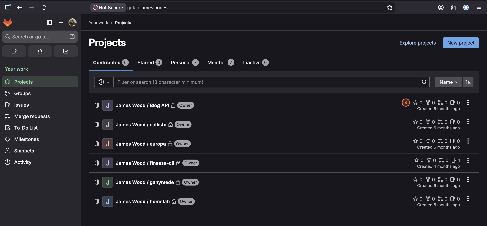
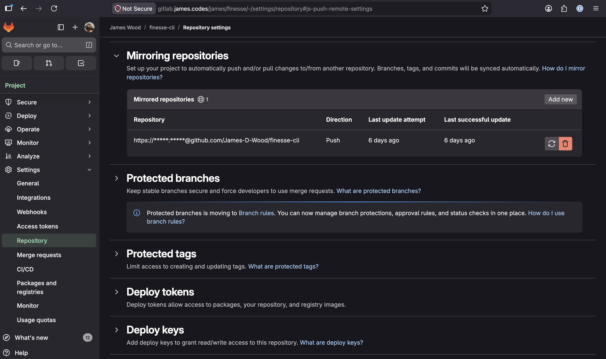

# GitLab

## Overview

GitLab has a self-managed product that you can install and run via Docker. I followed [this documentation](https://docs.gitlab.com/install/docker/) to get the service up and running on a Proxmox VM.



## Learnings

### Log Rotation

Fun fact: Docker does not enable log rotation out of the box. When I first installed GitLab, I had read from others online that it is a bit of a resource hog. So the first time my instance crashed due to the disk filling up, I wasn't shocked. I figured there were some events/metrics based data that was passively being generated even if I wasn't loading the instance up. By the time I had expanded the VM to be able to 40 GB and still ran into storage related crashes, I had an inkling something wasn't right. After looking into where my disk space was going, I realized that I had nearly 20 GB of docker logs stored up for the instance. This is how I learned that log rotation is something that must be configured on any machine running a Docker service. 

I followed [this documentation](https://docs.docker.com/engine/logging/configure/) on configuring logging drivers. 

The following was added to my `/etc/docker/daemon.json` file:

```json
{
  "log-opts": {
    "max-file": "5",
    "max-size": "10m"
  }
}
```

### Mirroring

I wanted to daily drive gitlab locally but still have my contributions backed up to GitHub in case my VM becomes corrupted or I spill an iced coffee on that poor, overworked NUC. Thankfully, this process is pretty straightforward with GitLab. Noting the relevant docs here because I seem to forget every few months or so.

- [Push Mirroring in GitLab](https://docs.gitlab.com/user/project/repository/mirror/push/)
- [Push Mirror to GitHub](https://docs.gitlab.com/user/project/repository/mirror/push/#set-up-a-push-mirror-from-gitlab-to-github)


