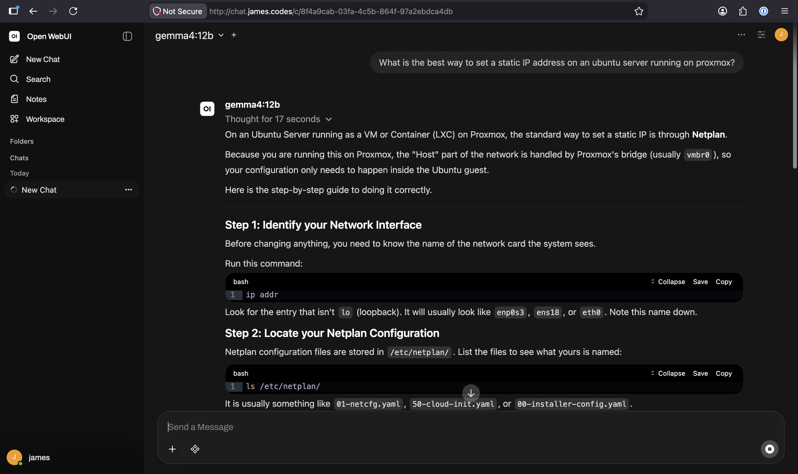

# Open WebUI

## Overview

Open‑WebUI is an open‑source web interface for interacting with large language models. I'm using it as my ChatGPT / Claude Desktop replacement at home as a chat client for my local Ollama instance.

