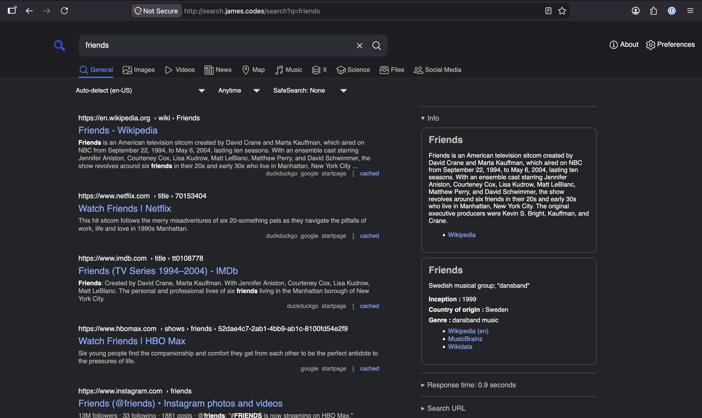

# SearXNG

SearXNG is free internet metasearch engine with a focus on privacy.



## Configuring SearXNG for Human Use

When I set up SearXNG originally I followed the following resource:

- [SearXNG Installation Container](https://docs.searxng.org/admin/installation-docker.html#installation-container)

## Configuring SearXNG as an Agentic Search Provider

When I set up SearXNG for my Open WebUI agents, I used the following resources:

- [Open WebUI Web Search](https://docs.openwebui.com/features/chat-conversations/web-search/agentic-search)
- [Open WebUI SearXNG Example](https://docs.openwebui.com/features/chat-conversations/web-search/providers/searxng)

The only additional config I needed to do in SearXNG to enable agentic search was to add the following to the settings file:

```yaml
search:
  formats:
    - html
    - json
```

Example Query:

```
http://192.168.0.187/search?q=developer+conferences+2027&format=json&pageno=1&safesearch=1&language=all&time_range=&categories=&theme=simple&image_proxy=0
```
